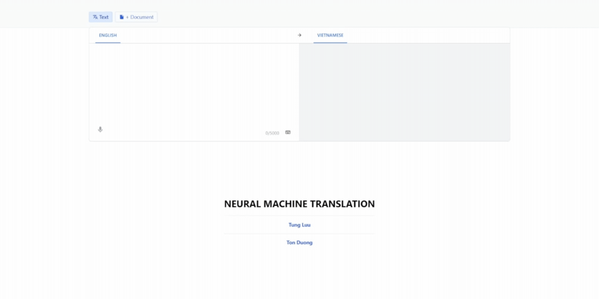

<!-- PROJECT LOGO -->
<br />
  <p align="center">
    <h1 style="text-align: center;">Neural Machine Translation</h1>
    <br />
    <ol  style="text-align:left">
       <strong>Members: </strong>
    <br />
    <li>
    <a href="https://github.com/tungluuai" target="_blank">Tung Luu</a> serves as an ML Engineer (Team Leader).
    </li>
    <li>
     <a href="https://github.com/duongtanton" target="_blank">Ton Duong</a> serves as a Web Developer.
    </li>
    </ol>
  </p>
</div>

## Introduction
- The goal of this project is to develop an application that translates from English to Vietnamese using the Transformer architecture.

- Transformer model is trained from scratch on two datasets:  <a href="https://huggingface.co/datasets/IWSLT/mt_eng_vietnamese" target="_blank">IWSLT'15 English-Vietnamese</a> and the dataset comprising 254,090 sentence pairs available on <a href="https://www.kaggle.com/discussions/general/253495" target="_blank">Kaggle</a>. Please refer to <a href="https://arxiv.org/pdf/1706.03762" target="_blank">Vaswani et al.'s paper</a> to gain a deeper understanding of this model.
- The model was evaluated using common metrics: BLEU, WER, and METEOR. Qualitative results indicate that the application demonstrates high semantic accuracy and expressiveness on short input sequences.

## Demo


## Technical
1. Programming language: Python

2. Library, framework: Flask, flask, Flask-SQLAlchemy, transformers, torchvision, sentencepiece, sacremoses

## Environment
1. Python
2. Visual Studio Code

## Implementation
1. Clone the repo
    ```sh
    git clone https://github.com/tungluuai/Transformer-Translation.git
    ```
2. Create directories with the following path:
    - `app\flaskr\model_translation\data`
    - Go to the following link to download the `transformer_model.pth` weight file: [Download Link](https://drive.google.com/file/d/1EImLEUTnhuzJL1P7ffzhdqCP1M93u5lP/view?usp=sharing)
    - Copy and place it into the newly created folder above.
3. Open a terminal in the `app` directory.

    **When initializing (if the `venv` folder does not exist):**

    Step 1:
    ```sh
    py -m venv venv
    ```

    Step 2:
    ```sh
    venv\Scripts\activate
    ```

    Step 3:
    ```sh
    pip install -r requirements.txt
    ```

    Step 4:
    ```sh
    flask --app flaskr run --debugger --reload --host=0.0.0.0 --port=4201 
    ```

    + Run on port 4200 (public). If you want to make it public, you need to configure the router.

    **When initializing (if the `venv` folder exists):** Open a terminal in the `app` directory.

    Step 1:
    ```sh
    venv\Scripts\activate
    ```

    Step 2:
    ```sh
    flask --app flaskr run --debugger --reload --host=0.0.0.0 --port=4201 
    ```

    + Runs on port 4200 (public). If you want to make it public, you need to configure the router.

4. After running, you can access the application at: [http://localhost:4201/](http://localhost:4201/)

5. Done.

<br/>

